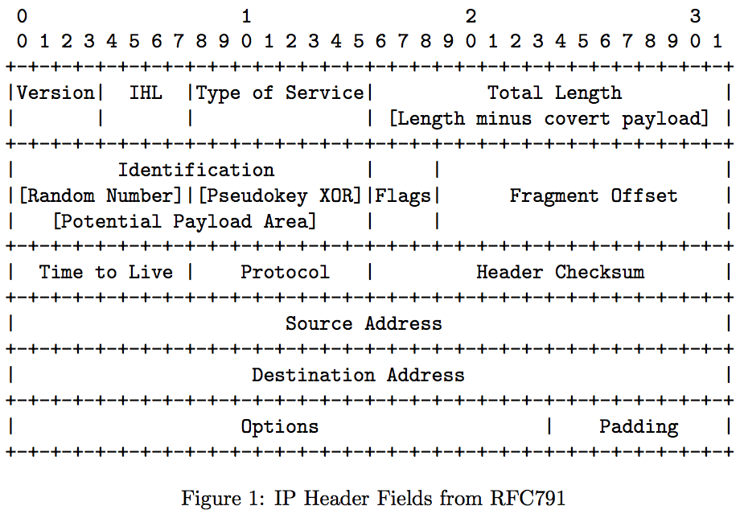
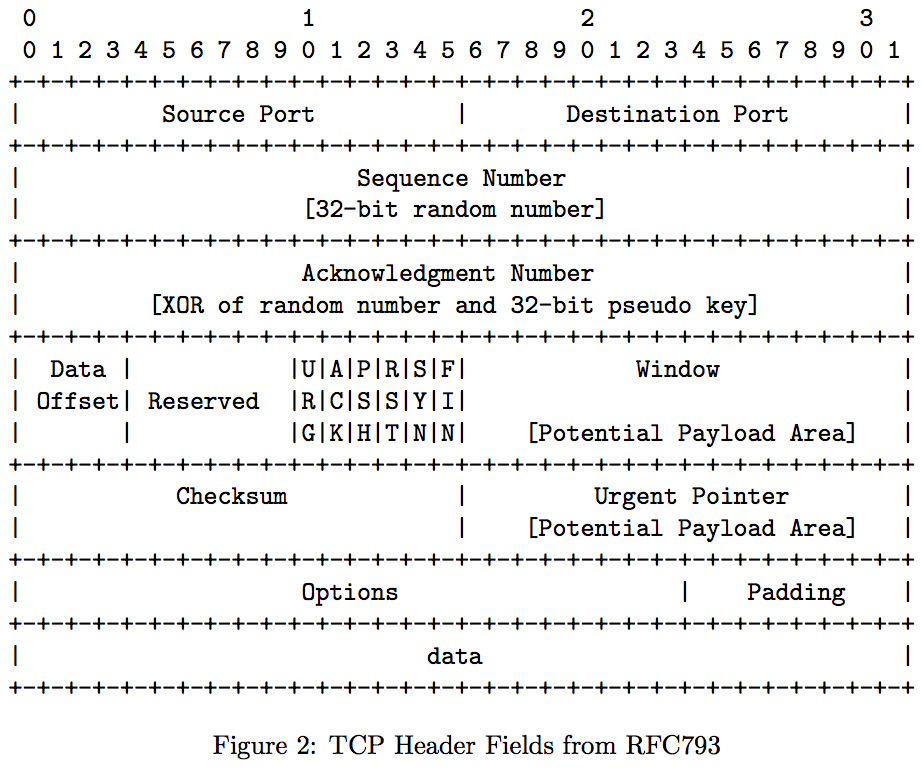

_I wrote this as the deliverable on an independant study program in 2006.  You can see the code on github or the original [PDF.](covert.pdf)_

Abstract
========

Covert channels are used to secretly convey information from one place
to another. This document presents two means for covert network
communication using fields in the TCP and IP headers in an novel manner.

Background
==========

Computer criminals often attack personal, business, government, or
educational systems that contain valuable data. This data can include
customer names and credit card numbers, confidential business
information, compromising photographs, or government classified
information. Once access to a system has been obtained, the attacker
frequently is required to copy the data over the Internet to a safe
location before it can be further utilized.

It is important for the attacker to remain hidden while assaulting a
system and retrieving its data. If detected, there are any number of
defenses and obstacles which can be erected by the system owner to
protect a computer and its data, even after the system has been
compromised. In many cases, the attacker is accessing the system
illegally. Discovery is the prelude to collecting evidence that can be
used to pursue litigious forms of punishment and monetary damage.

If the original system compromise does not alert security staff at the
victim organization, the bandwidth use and extra traffic as the data is
copied across the network may. Intrusion detection systems (IDSs),
intrusion prevention systems (IPSs), and other network monitors can be
configured to detect unusual outgoing traffic from any given system. In
particular, many firewalls can block traffic to or from a specific host
or network based on a packet’s source address, source port, destination
address, and destination port.

To copy the valuable data and still avoid blockage or detection, the
attacker must use a “covert channel” (CC), which is a means of
transmitting information surreptitously. In some cases, this is
accomplished by making the attacker’s traffic appears to be as
indistinguishable as possible from routine network traffic. IDSs, IPSs,
and firewalls should allow the packets associated with the CC to pass
unmolested, “believing” they are legitimate traffic. The goal is not
merely to obscure the existence of a transmission, but by its obscurity
to prevent detection of the attacker and the system compromise. By
avoiding detection, the attacker can maintain control over the
compromised system for as great a time as possible.

Following information gathering on the subject of covert channels, it
was decided that a well-informed and serious attacker could use an
advanced covert channel to bypass network detection and protection
system. In order to bring awareness to information leaks in general and
to help decrease the effectiveness of this type of attack, proactive
examination of this area should be performed to assess means by which an
attacker might use a CC to leak information from a network entity and to
investigate how it could be detected.

Goals, Scope, and Constraints
-----------------------------

The goal of this investigation is to implement a proof-of-concept covert
channel that is capable of circumventing traditional means of detection
and with the new findings, to examine ways to detect that
proof-of-concept channel.

This document discusses the scope and background for the investigation,
describe the proof-of-concept software, catalog means for detecting and
defending against this type of covert channel, and detail potential
areas for future effort.

### Scope and Assumptions

For the scope of this inquiry, there are some assumptions made regarding
so-called “traditional means of detection” which are generally accurate
in the Information Security Office at The University of Tennessee. (The exception being cases in which integrity of the University’s network is threatened.) As the members of that group bring together representative views of
industry training and standards, it is extrapolated that these
assumptions are true to some degree in other security organizations.

First, more suspicious packets are available to any number of security
analysts than they have time to personally and completely analyze. (This
is a safe assumption: no analyst has time to check all packets even from
their own workstation.) To leverage their own time, IDSs, IPSs, and
firewalls will be used to block *known* undesirable traffic and help
identify suspicious traffic for later analysis.

To attack a security analyst’s packet review process, a CC should not
use traditional locations in a network packet–such as the payload
area–to transmit data. Instead, certain identification and enumerated
sequence fields will be used.

Second, IDSs and IPSs rely on signatures to identify and (in the case of
IPSs) block suspicious or undesirable traffic. Firewalls do a similar
task, examining a combination of header fields. While these systems
maintain limited state regarding traffic flows, there will always be
more information supplied and suggested by visible network traffic than
there will be available computing resources.

The attack against these systems will be three-part. First, the use of
packet identification fields to utilize a scope wider than what can be
stored by an IDS or IPS. Second, to avoid detection by signature, no
static strings can be used to identify a single packet as being
associated with a CC. Third, to avoid blockage by firewall, existing
(and assumed successful) traffic will be sniffed off the wire, modified,
and retransmitted.

For complete undetectability, (see NOTE) there should be no commonality between
any series of packets in the entire stream. While the proof-of-concept
seeks to diminish the stream commonality as much as possible, a true and
complete implementation of this idea is more complex than is addressable
by the scope of this investigation.

_NOTE: It is obviously naïve to say that a channel is “undetectable” when new means for discovery are commonly being developed. Here the word is used instead of the more cumbersome and correct phrase “difficult to be detected.”_

There are a number of areas which are declared to be desirable for
practical use, but are outside the scope of this document and the
underlying inquiry.

-   **Encryption:** All network traffic of a sensitive nature should be
    encrypted. Because the attacker is attempted to conceal
    information–specifically their existence on the network–the covert
    channel traffic should be encrypted. Pre-encryption of data or
    addition of one of the large number of strong encryption packages
    available is an exercise for the future.

-   **Bi-directional communication:** The methods for communication that
    are described later are strictly one-way. Some suggestions are made
    for potential means of adding a return channel.

-   **Stream integrity and reliability:** Without a return channel,
    guaranteeing the stream integrity becomes difficult or impossible.
    Suggestions are made in later sections for use of erasure codes to
    increase the quality of the overall stream.

-   **Functionality:** One concern of the administration was creating a
    tool so powerful that it was introducing software that made a new
    attack simpler, effectively “selling arms to the enemy.” The
    software written in the course of this investigation deliberately
    avoids providing a complete communications solution. It is meant to
    provide a platform for demonstration of the ideas detailed in this
    document, specifically: one-way transmission of a document between
    two program instances on the same unswitched network. By omitting
    some necessary components, it is hoped that these tools can be made
    useless to “script kiddies” and other malicious attackers without
    significant extra effort.

### Constraints

To be successful, a CC must take advantage of several weaknesses in
traditional network attack detection.

Criteria were developed that discuss standard detection methods and what
a covert channel can and cannot do in order to remain undetectable.

1.  **The covert channel must not interfere with normal delivery of its
    own packets.** Network packet header fields used to deliver or route
    a packet from one point to another are off-limits for data
    transmission use.

2.  **There should be no single or combination static signature that
    marks a packet as part of a covert channel.** Traffic signatures are
    traditional means by which an IDSs or IPSs is able to identify and
    block undesirable traffic. If every packet in the transmission
    contains a known value or string, a signature can be created
    allowing for easy detection and removal. Unfortunately, this makes
    it difficult for the CC software to recognize packets that are meant
    for it.

3.  **The covert channel must only use packet fields where blocking any
    single value within the scope of that field would interfere with
    normal network traffic.** IP options and other “additional but not
    required” components are not available for use, specifically because
    they are not *required.* These optional fields can be blocked
    without affecting the overall data stream. Instead, only fields that
    represent packet identification numbers can be used: fragmentation
    offset, IP identification field, TCP sequence and acknowledgment
    numbers, and similar elements can be used. In any of those cases,
    blocking a particular value will cause normal use of the involved
    protocols to malfunction.

4.  **The covert channel must utilize existing network traffic in a
    least-impact manner.** To avoid detection, the best time to send a
    covert packet is when it can blend in with other traffic that is
    traversing the network. Covert traffic should not cause alerts on
    any system that it is associated with, and if possible it should
    cause no alerts whatsoever.

Initial Proof of Concept
========================

For the initial proof-of-concept implementation (POC1), several major
decisions had to be made. This version only works across a single subnet
space. It becomes especially useful in obfuscating the sender and
receiver on a single-segment or super-netted network, such as a large
wireless network.

The POC1 is a console-mode application developed in C on Mac OS X 10.4
(a BSD variant) using *gcc* as provided in Apple’s [Xcode](http://www.apple.com/macosx/features/xcode/) development
suite. Packets are captured off the wire using the near-ubiquitous
library [*libpcap*](http://www.tcpdump.org/) and are transmitted using the kernel-interface
routines in [*libdnet*](http://libdnet.sourceforge.net/). Both of these libraries were written to allow
abstract access to low-level network functions in a portable manner. In
combination with strongly portable driver code, it is hoped that any
choice of platform will have little impact on later work.

General Functionality
---------------------

One major goal is making the CC traffic appear as similar as possible to
other traffic on the wire at present. To address this, the software
modifies and retransmits captured network traffic.

Specifically, the transmitting software listens on the wire for an
Internet protocol version 4 (IPv4) packet of the necessary size to
encode a data byte that has not been marked as a covert packet (as
described later.) The software then sets the header flag that signifies
the packet is part of a fragment chain, marks the packet as a CC
participant (excluding it from redundant reuse later), encodes a data
byte, recalculates the IP header checksum, and retransmits the packet
onto the wire.

The receiving software examines all packets that are available on the
wire, looking for packets that are part of the CC. When one is found,
the encoded byte is written to the specified output.

Packet Markers
--------------

A means had to be found so that a packet containing covert data could be
distinguished from others in the traffic stream. At the same time, this
means had to be virtually undetectable by a firewall, IDS, or IPS.
Because the majority of these systems work by looking for a specific
signature or series of bits in the packet, the POC1 uses an eight-bit
identifier supplied by the user and shared between both source and
destination. It is presumed that this identifier will change
periodically between one time the software is executed and another.

To mark a packet as being involved with the covert channel, an 8-bit
random number is chosen for each packet to be sent, and is stored in the
bits zero through seven of the IP packet (see [Figure 1](IPHeader.png))
“identification” field. The same random number is then XOR’ed with the
user-supplied identifier and the final value is stored in bits eight
through fifteen of the identification field.

The receiving software performs roughly the reverse to determine if a
particular packet is part of the covert channel. The low eight bits of
the IP identification field are XOR’ed with the high eight bits, then
compared against the user-supplied key. If they match, the packet is
processed further. Otherwise it is discarded.

Use of the relatively small eight-bit identification marker results in a
one in 255 chance that a random packet will be falsely recognized as
part of the covert channel. On a moderately busy network, this creates a
ridiculously high error rate that is unacceptable for practical use.
This problem is addressed in the second proof of concept.

Additionally, the lack of stronger authentication in the packet leaves
the system open for man-in-the-middle attacks. Defense against this
problem is out of the scope of the investigation.

Data Encoding
-------------

To meet dual needs of data transmission and stealth, the byte sent as
payload is encoded in a combination of the “fragmentation offset” and
the “total length” fields, as in [Figure 1](IPHeader.png). To provide a light
layer of obfuscation, the fragmentation offset is set by the sender to
the packet length minus the data byte for encoding. The covert receiver
reverses the process by subtracting the value of the length field from
the header offset to yield one data byte.

In the proof of concept programs, it is assumed that both the sender and
receiver are on the same subnet so no changes are made to the
destination IP address. The sender transmits a modified packet and
assumes that the receiver will be able to detect and decode it. The
“more fragments” bit is set so that even if an unintentional recipient
receives the packet, it will be eventually timeout discarded as part of
a incomplete fragment chain. The timeout causes the return of an “ICMP
fragmentation timeout exceeded,” message which may be a path for later
channel detection.

Second Proof of Concept
=======================

The functionality of the second proof of concept (POC2) is very similar
to POC1, with the major change being a move away from use of a
fragmentation offset greater than zero. This allows additional fields in
the TCP header to be available without raising undue attention.
Additionally, a rudimentary metamorphic system was used so that data was
encoded in one of several different locations in the packet.

Packet Marking
--------------

As mentioned above, one of the major problems with the initial proof of
concept was false recognition of packets. The eight-bit marker allows an
unacceptably high false positive rate. A sample on UT’s wireless network
yielded an unacceptable 34 false positives in a seven minute period
during the highest load time of the day. For simplicity, and to avoid
requiring a two-way channel, POC2 uses 32-bit identifiers in the TCP
sequence number field.

Similar to POC1, a pseudo-key is provided by the user for stream
identification. In POC2, the pseudo-key is 32-bits in length creating a
theoretical 1 in 232 chance of a false positive. The same
seven-minute sample with POC2 yielded zero false positives. While
overall reliability could be improved by use of a rotating subset of a
longer pseudo-key, this is left for future investigation.

For each packet, a new 32-bit random number is stored in the TCP
“sequence number” field. The bitwise XOR of that random number and the
pseudo-key is stored in the TCP “acknowledgment” field, as seen in
[Figure 2](TCPHeader.png).

To detect if an incoming packet is part of the CC, the receiving
software examines each packet looking for a TCP header. If the XOR of
the TCP “sequence number” and the TCP “acknowledgement” fields match the
32-bit pseudokey, the packet is decoded as being part of the covert
channel.

Data Encoding
-------------

In order for the TCP header to be an expected part of a packet fragment,
it must be seen in the beginning of the first fragment. This means that
the fragmentation offset must always be zero. Because the data encoding
method used in POC1 requires a difference in

Instead of encoding the payload data in the fragmentation offset, one of
three header field locations (IP Identification, TCP Window, and TCP
Urgent Pointer) as noted by “`[Potential Payload Area]`” in [Figure 1](IPHeader.png) and [Figure 2](TCPHeader.png). Which of these locations is selected is
based on the modulus of the 32-bit random number that is stored in the
TCP “sequence number” field.

Detection and Defense
=====================

Once the proof-of-concepts were debugged and deemed essentially
complete, their design was frozen so that the detection and analysis
findings would have a stationary target to address.

As was expected, default installations of *Snort*–a popular open-source
IDS tool–were unable to recognize the CC traffic specifically as a
covert channel. Presumably this is because no signature existed.
However, it was occasionally flagged as anomalous data.

Detecting this Covert Channel {#Detection}
-----------------------------

Multiple potential detection techniques were observed, based on the
final output from the covert channel software. Unfortunately, few of
them lent themselves to the packet-at-a-time or stream reconstruction
analysis methods that our IDSs and IPSs provided. Those that showed
signatures yielded a large number of false positives. A scoring system
that suggests investigation of the hosts with the largest number of
signature hits.

-   **Duplicate Packets:** The covert channel traffic modifies and
    retransmits packets shortly after the originals are sent. While it
    would be difficult and unwise to block duplicate packets, the large
    number of duplicate packets created by the CC transmitter would
    likely be sufficient to merit investigation with the expectation of
    fouled equipment or software.

-   **Unusual Field Values:** Some fields used to encode data may have
    unusual values. For example, the TCP Urgent Pointer may point to an
    area past the end of the packet or the window size may not have a
    power-of-two-aligned value. While these are unusual, they’re very
    difficult to identify programmatically in such a way that doesn’t
    create an unusual number of false positives.

-   **Packet Preambles in Fragments:** False fragments in POC1 will
    often appear to come from the middle of a large packet. By using
    packets off the wire, data and headers that will commonly come from
    the beginning of a packet, will now be appearing in the middle of a
    larger packet. Detection of this anomaly will likely only occur due
    to visual packet inspection.

-   **Unusual-Length Fragments:** Packets are fragmented when they are
    sent across a medium whose maximum transmission unit (MTU) exceeds
    the length of the packet. Ethernet provides the most common MTU
    size: 1500 bytes. Both POC1 and POC2 will create fragments that are
    unusually small: sometimes approaching the *minimum* packet size.

-   **Unusual Protocol Fragments:** Both POC’s use fragmentation to
    avoid notice by upper network layers of the destination system.
    While UDP fragments are reasonably commonplace (especially on a
    network that uses Solaris-based NFS servers), TCP goes out of its
    way (via *Path MTU Discovery* documented in RFC1191) to create
    packets that are smaller than the smallest MTU on the path between
    sender and recipient. Additionally, ICMP messages are often small
    (read: less than any reasonable MTU) and any fragmentation of these
    packets could be considered an anomaly.

-   **Unusual Order for TCP Sequence Numbers:** POC2 rewrites the TCP
    sequence and acknowledgment numbers to mark packets. Tools such as
    [*WireShark*](http://www.wireshark.org/) and [*tcpdump*](http://www.tcpdump.org/) display captured packets with
    relative sequence numbers based on the SYN packets or the first TCP
    packet seen. They flag any packets that are outside the transmission
    window as either a lost segment or a retransmission.

-   **Excessive Fragmentation Count:** Again, both POC’s use
    fragmentation to avoid notice by upper network layers of the
    destination system. This causes what can be an unusual number of
    fragments (depending on the network) and an unusual amount of ICMP
    Fragmentation Timeout backscatter. Either of these can be counted
    and the top hosts monitored or investigated.

Defense Methods
---------------

A proactive means for defending against both POC’s is use of a firewall
that rewrites IP identification numbers and TCP sequence numbers. This
firewall would use a bijective function to map the original
identification values on one side to a different value on the other. It
would need to modify both incoming and outgoing packets in order to
completely remove the protected area from participation in this type of
channel.

Additionally, network monitoring for systems that show an unusually
large number of the traits mentioned in Section [Detection] would work
as a reactive measure.

Future Work
-----------

In the process of examining the subject area, writing the proof of
concept software, and determining defenses against it, several areas for
future work were suggested. These were not pursued due to scheduling
issues, financial resources, or scope limitations.

The most important area for further development appears to be
modification of the design to allow two-way communication or (at least)
acknowledgment responses. Without that, there is no way to guarantee
reliable communication. Unfortunately, the present scheme doesn’t easily
permit this without violating some design goals and making the overall
channel significantly easier to detect.

-   **Covert Network Layer:** This scheme could be made more valuable by
    enhancing the POC software to allow the use of the covert channel as
    part of an existing network layer. Either by providing a network
    layer interface similar to IP, or as a higher layer interface with
    sockets. This would allow its use with many existing software
    packages.

-   **Responses through ICMP Backscatter:** One novel means of
    implementing two-way communication would be to make use of the
    padding or payload in the ICMP Fragmentation Timeout backscatter
    created as a side-effect to the use of fragmentation packets. This
    could be used to send acknowledgments and increase the reliability
    of the channel, even if full two-way communication is impossible.

-   **Encryption:** Incorporation of encryption could seriously
    strengthen the usefulness of this type of covert channel. Instead of
    using random numbers and a pseudokey, use of a one-time pad or a
    similar technique of evenly-distributed values could make the
    payload more difficult to detect and decode by an observer.
    Additionally, the extreme vulnerability of this channel (once
    detected) to man-in-the-middle insertion attacks could be largely
    mitigated through the aforementioned technique.

-   **Erasure Codes:** Erasure codes create a larger message based on an
    original such that the original message can be recreated given a
    sufficiently-sized subset of the new encoding. By encoding the
    original message in this manner, a one-way stream can be created
    that would strongly increase the chances that the message would
    arrive unmodified.

Conclusions
===========

Both covert channel proof-of-concept models met all the design goals and
constraints.

1.  They were able to transfer data between the source and destination
    without raising IDS or IPS alerts.

2.  They did not interfere with the routing or delivery fields of the
    packets that were modified.

3.  There were no single or combination static data signatures unique to
    the covert channels.

4.  The channels used only serial-number and identification fields.

5.  The channels used network traffic in a least-impact manner.
